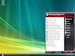
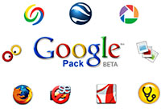
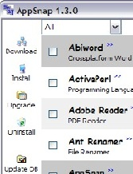
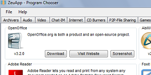
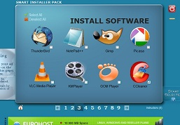
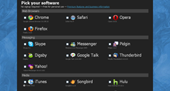
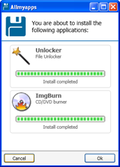

O windows logo após a instalação vem com poucas coisas úteis, nem um navegador de internet vem junto (\_**¿**\_alguém acha q o IE é navegador?), aí a gente perde um tempão para pesquisar, baixar e instalar softwares para tornar o pc usável (+- pq ainda é windows né!). Bom, deixando a discussão de lado, vou escrever sobre como diminuir o drama.

Há algum tempo começaram a aparecer maneiras de facilitar a instalação de múltiplos programas ao mesmo tempo e manter uma lista de preferidos.

Bem antigamente a gente gravava os programas favoritos em alguns disquetes e andava com eles por aí. Depois com os cds já dava para guardar mais coisas, mas aí o mundo acelerou e os programas ficavam obsoletos muito rapidamente, quando vc pegava o cd e instalava os programas, tinha que conectar para atualizar a maioria dos programas. De vez em quando a gente queimava outro cd para atualizar os programas, com os pendrives pelo menos acabou o desperdício.

### 1) PortableApps

\[caption id="attachment_71" align="alignright" width="157"\] Menu do Portable Apps no Windows\[/caption\]

Veio o [_PortableApps_](http://portableapps.com/) \[1\]. Além de ser um conjunto de softwares fácil de manter atualizado, ainda roda tudo direto do pendrive. Mas ele não é exatamente para instalar os softwares no pc, até pode ser usado assim mas não é sua função principal. Nem é para usuários comuns, pois exige alguns conhecimentos e faz umas coisas diferentes, como deixar os ícones fora do menu padrão do windows.

Pró: Conjunto completo de programas

Contra: A maioria dos softwares são alterados para rodar de pendrive e não têm a mesma performance e integração ao sistema

Licença: free (as in freedom and beer)

### 2) Google Pack

\[caption id="attachment_70" align="alignleft" width="200"\] Programas instalados pelo Pack\[/caption\]

Uma das primeiras tentativas de organizar a bagunça veio com o [_Google_ Pack](http://pack.google.com/) \[2\], que instala vários softwares de uma só vez.

Pró: instala vários em um só click e os mantém atualizados

Contra: poucos softwares e deixa um programa rodando em background

Licença: free (as in beer)

### 3) AppSnap

\[caption id="attachment_72" align="alignright" width="167"\] AppSnap estilo Synaptic\[/caption\]

Existiram também uns softwares inspirados nos repositórios do Linux, como o [**AppSnap**](http://appsnap.genotrance.com/) \[3\], que mostra uma lista de softwares onde vc pode escolher vários e instalar todos juntos.

Pró: lista grande de softwares e mantém atualizados

Contra: última atualização em 2008

Licença: free (as in freedom and beer)

### 4) ZeuApp

Outro notável é o [ZeuAPP](http://blog.zeusoft.net/zeuapp/) \[4\], só que esse só instala um de cada vez.

Pró: grande lista de softwares livres e grátis

Contra: instala um de cada vez

Licença: free (as in freedom and beer)

### 5) SIP

\[caption id="attachment_74" align="alignright" width="257"\] Tela do Smart Installer Pack\[/caption\]

Aí tem o [_Smart Installer Pack_](http://smartinstallerpack.com/) \[5\], que é um programa até grandinho (25mb) com uma lista boa de softwares, interface bonitinha, mas precisa instalar e deu uns problemas quando testei. E tem propagandas dentro dele.

Pró: interface bonitinha

Contra: deu uns paus (instalou o google chrome em romeno!)

Licença: free (as in beer)

### 6) NINITE

Agora tem uns que são web, não precisa instalar, no [_Ninite_](http://www.ninite.com/) \[6\] por exemplo basta escolher os programas na página e baixar o instalador. Tem também uma versão paga com um modo offline útil para quem faz manutenção. Promete perceber se o sistema é 32 ou 64 bits.

Pró: não precisa instalar

Contra: a lista de programas não é muito grande, mas é o suficiente

Licença: free (as in beer), tem também versão paga

### 7) AllMyApps

\[caption id="attachment_84" align="alignright" width="172"\] Allmyapps baixando aplicativos\[/caption\]

Outro web com uma lista maior de softwares é o [**Allmyapps**](http://allmyapps.com/) \[7\], funciona como o Ninite. Porém exige cadastro, mas dá para cadastrar por twitter, facebook, yahoo, openid ... Tem separação para xp, vista, 7, e acredite, ubuntu 8.04, 8.10, 9.04 e 9.10!!

Algumas vezes dá problema se algum dos softwares já está instalado no micro, ou se um dos programas engasga no downloado ou na instalação e outros probleminhas.

Pró: não precisa instalar, lista grande de softwares

Contra: exige cadastro

Licença: free (as in beer)

Atualização:

### 8)  FreeApp

Funciona como o AllMyApps,  mas o [FreeApp](http://www.freenew.net/index.html "FreeApp") \[8\] não exige cadastro, a lista de softwares é um  pouco menor mas tem de tudo, bacaninha.

Pró: não precisa instalar, lista grande de softwares, não exige cadastro

Contra: -

Licença: free (as in beer)

---

## Conclusão:

Para a maioria dos casos serve o Allmyapps FreeApp.

Caso queira uma lista ainda melhor de softwares e um programa livre o melhor é o Zeuapp.

Se o Appsnap ainda estivesse sendo atualizado seria o melhor, pena que o desenvolvimento parou  : (

\[1\] http://portableapps.com/

\[2\] http://pack.google.com/intl/en/pack\_installer.html

\[3\] http://appsnap.genotrance.com/

\[4\] http://blog.zeusoft.net/zeuapp/

\[5\] http://www.smartinstallerpack.com/

\[6\] http://ninite.com/

\[7\] http://www.allmyapps.com

\[8\] http://www.freenew.net/index.html

Não conheço muitos usuários desses softwares então por favor se vc usa algum deles ou conhece outro, deixe um comentário.
