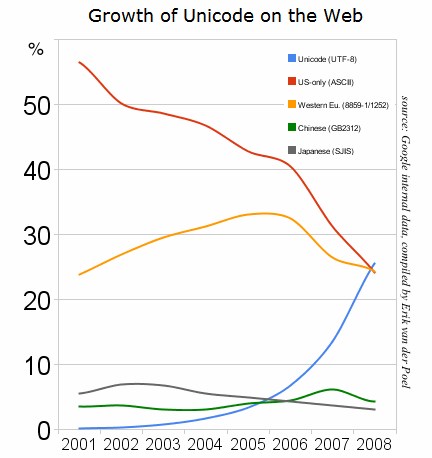

Atualização: Fica fácil de usar as letras com o [plugin para Google Chrome](https://chrome.google.com/webstore/detail/utf-8/fcemphgmjnjpmmdhcedhjiegickfbiia).

No twitter é possível inserir símbolos bacanas no lugar de palavras e  assim  deixar as mensagens mais curtas para caber nos 140 caracteres. Também serve para outros sites que utilizem utf-8.

Alguns exemplos:

> Vou para o ✈ antes q a☽ apareça, mas antes vou tomar um ☕ pq tá ☔, qd chegar te 
>
> Grande , ✍ e me manda os detalhes por ✉ para eu dar um ✔
>
> vamos declarar ⚐ para dar uma chance à ☮
>
> ☄ se aproxima da terra, risco de ☢☣
>
>  temos q colocar na ⚖ antes de tomar a decisão
>
>  I ♥ you

É bem difícil encontrar os símbolos, então juntei alguns dos principais e mais úteis a seguir:

Carinhas, smiles, emoticons:  
☹ ☺ ☻ ☃ ☠ 

Sinais:  
⚠ ⚡ ✆   ♿

Coisas úteis:  
✈  ☎ ☏ ☂ ☔ ✉ ☄☽ ☾☕ ✇ ❤   

Religiões:  
☯ ✝ ✞ ✟ ☨ ☦ ☭ ☮ ☪ ☫ ☬ ☩ ✠ ☧ ✡

Signos:  
♈ ♉ ♊ ♋ ♌ ♍ ♎ ♏ ♐ ♑ ♒ ♓

Gênero (um desses deve ser zumbi, só não sei qual):  
♀ ♂ ☿ ♁ ⚢ ⚣ ⚤ ⚥ ⚦ ⚧ ⚨ ⚩

Flores:  
❁ ❀ ✿ ✽ ✾ ❃ ⚘ ☘ 

Xadrez:  
♚ ♔ ♛ ♕ ♜ ♖ ♝ ♗ ♞ ♘ ♟ ♙

Cartas:  
♥ ♡ ♠ ♤ ♦ ♢ ♣ ♧

Estrelas:  
✩ ★ ☆ ✪ ✫ ✬ ✭ ✮ ✯ ✰ ☼ ☸ ☉ ❂

Música:  
♬ ♫ ♪ ♩

Reciclagem:  
♺ ♽ ♼ ♻ ♲ ♳ ♴ ♵ ♶ ♷ ♸ ♹

Asteriscos:  
✱ ✲ ✳ ✴ ✵ ✶ ✷ ✸ ✹ ✺ ✻ ✼ ❉ ❊ ❋

Flocos de neve:  
❄ ❅ ❆

Profissões:  
☤ ⚕ ⚒ ⚓ ⚙ ⚜

Ciência:  
☢ ☣ ⚝ ⚛

Marcadores:  
☐ ☑ ☒ ✓ ✔ ✕ ✖ ✗ ✘ ✚

Mãos:  
✌ ✍ ☟ ☝ ☜ ☚ ☞ ☛

Setas:  
➘ ➙ ➚ ➝ ➜ ➟ ➡ ➢ ➤ ➩ ➿ ⟲ ⟳ ⟷ ⟵ ⟶ ⟿

Tesoura e lápis:  
✂ ✄ ✏ ✎ ✐

Marcas:  
© ® ™ 

Moedas:  
£ $ €

Matemática:  
∞ ø ≠ % …     ∫ ≈ ∴ ∝

Letras antigas:  
   µ ∂ Ω Φ Ψ λ ϴ ω

A interrogação usada em espanhol (acho que deveria ser utilizada em todos os idiomas):  
¿

Temperatura:  
℃ ℉

Bandeiras:  
⚑ ⚐

Ahnn, sei lá:  
¶ § ❝ ❞ ❦ ☙ ♨ ☁ ⚖

Se quiser copiar todos estes caracteres especiais acima juntos de uma vez, deixei aqui: [http://codexico.com.br/files/utf8.html](http://codexico.com.br/files/utf8.html)

Quando estiver fazendo um html não esqueça de avisar ao navegador que o conteúdo é utf, colocando no <head>:

<meta content="text/html charset=UTF-8" http-equiv="Content-Type">

E html5 fica assim:

<meta charset="utf-8">

Links para as tabelas completas de caracteres:

[http://macchiato.com/unicode/chart/](http://macchiato.com/unicode/chart/) separados por tipos e bem organizado

[http://www.utf8-chartable.de/unicode-utf8-table.pl](http://www.utf8-chartable.de/unicode-utf8-table.pl) separados por tipos e com mais informações

[http://www.alanwood.net/unicode/menu.html](http://www.alanwood.net/unicode/menu.html) separados por tipos e com uma página para cada

[http://tlt.its.psu.edu/suggestions/international/bylanguage/mathchart.html](http://tlt.its.psu.edu/suggestions/international/bylanguage/mathchart.html) especializado nos caracteres matemáticos

Olha só um jogo de xadrez em 140 caracteres:

1 e4 ♞f6  
2 e5 ♞d5  
3 c4 ♞b6  
4 d4 d6  
5 f4 dxe5  
6 fxe5 ♞c6  
7 ♗e3 ♝f5  
8 ♘c3 e6  
9 ♘f3 ♝e7  
10 e2 O-O  
11 O-O f6  
12 ♘h4 fxe5  
13 ♘xf5 exf5  
14 d5 ♞d4!

➤➤ ¿Conhece + exemplos de frases usando ut-8? Quem escrever nos comentários ganha uma estrelinha ☆

**Atualização** \[17/10/10\]

Se ainda não te convenci, olha o gráfico do google mostrando que em 2008 utf já era a codificação mais usada:

**Novidade:**  Você leu e pensou "¿_O xico tá emo agora, e\_\_screvendo sobre coisinhas bonitinhas?_ ¿_Ou está tentando aumentar a audiência com coisinhas pops?_", nada disso, é que eu estava aprendendo a fazer extensões para o Firefox e precisava de algo fácil de fazer.

Então aí está uma extensão para Firefox e outra para o Google Chrome:

[https://addons.mozilla.org/en-US/firefox/addon/242192/](https://addons.mozilla.org/en-US/firefox/addon/242192/)

[https://chrome.google.com/extensions/detail/fcemphgmjnjpmmdhcedhjiegickfbiia](https://chrome.google.com/extensions/detail/fcemphgmjnjpmmdhcedhjiegickfbiia)

Ainda estão bem básicas, mas vai melhorar, as próximas mudanças estão em [http://www.pivotaltracker.com/projects/127653](http://www.pivotaltracker.com/projects/127653), se tiver uma ideia escreva lá.

O código, como sempre está no github:

firefox: [http://github.com/codexico/UTF-8-Firefox-Extension](http://github.com/codexico/UTF-8-Firefox-Extension)

chrome: [http://github.com/codexico/UTF-8-Chrome-Extension](http://github.com/codexico/UTF-8-Chrome-Extension)
