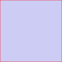
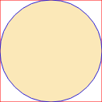

No html5 apareceu a tag `<canvas>`, com ela é possivel desenhar com código javascript, e até animar o desenho.

Como sou péssimo para desenhar resolvi experimentar com o canvas quando tive que fazer um ícone para a extensão de utf-8 que fiz para o Google Chrome, na documentação dizia que o ícone podia ser em canvas (é bom para extensões que mostram algum movimento no ícone), então vamos nessa ⚡

O ícone da extensão envolve os 3 principais e mais simples elementos, um retângulo, um círculo e texto.

Tudo começa com um arquivo html:

`Canvas tutorial`

Mas assim ele não faz nada, precisa executar ao carregar a página, para isso é necessário um pouquinho de javascript. Um template para começar um canvas ficaria assim:

```js
function draw() {
  var canvas = document.getElementById("icon");
  if (canvas.getContext) {
    //verifica se o navegador suporta
    var context = canvas.getContext("2d");
  }
}
```

A forma mais básica é o retângulo, prático para demarcar o tamanho do desenho.

```js
function draw() {
  var canvas = document.getElementById("icon");

  if (canvas.getContext) {
    var context = canvas.getContext("2d"); //retangulo
    context.fillStyle = "rgb(0 0 200 / 0.2)"; //cor do preenchimento
    context.fillRect(0, 0, 128, 128); //background
    context.strokeStyle = "#FF0000"; //cor da borda
    context.strokeRect(0, 0, 128, 128); //borda
  }
}
```

[](http://codexico.com.br/blog/wp-content/uploads/2010/10/tutorial-canvas3.png)

O canvas só suporta diretamente retângulos e texto, para o resto é necessário um "path", usamos _beginPath()_ para iniciar e _closePath()_ para terminar, só então dá pra desenhar com o _stroke()_ ou o _fill()_.

```js
function draw(){
  var canvas = document.getElementById('icon');

  if (canvas.getContext){
    var context = canvas.getContext('2d'); //retangulo
    context.strokeStyle = "red";
    context.strokeRect(0,0,128,128);
    circulo context.fillStyle = "rgb(241 178 21 / 0.3)";
    context.strokeStyle = "blue";
    context.beginPath();
    var x = 64; // = 128/2 - centraliza o circulo
    var y = 64;
    var radius = 64; //raio do circulo = diametro/2
    var anticlockwise = true;
    var startAngle = 0; //inicia o arco na posição 0 graus (direita)
    var endAngle = Math.PI\*2; //termina o arco na posição 360 graus (volta completa)
    context.arc(x, y, radius, startAngle, endAngle, anticlockwise);
    context.closePath();
    context.stroke(); //desenha a borda
    context.fill(); //preenche
 }
}
```

[](http://codexico.com.br/blog/wp-content/uploads/2010/10/tutorial-canvas4.png)

Como a extensão que eu estava fazendo envolvia caracteres utf-8, resolvi economizar no desenho e usar uma estrela em utf mesmo.

```js
function draw() {
  var canvas = document.getElementById("icon");
  if (canvas.getContext) {
    var context = canvas.getContext("2d"); //circulo
    context.fillStyle = "rgb(241 178 21 / 0.3)";
    context.strokeStyle = "blue";
    context.beginPath();
    context.arc(64, 64, 64, 0, Math.PI \* 2, true);
    context.closePath();
    context.stroke(); context.fill(); //texto context.strokeStyle = "rgb(2 93 198 / 1)";
    context.fillStyle = "rgb(2 93 198 / 0.9)";
    context.font = "italic bold 146px sans-serif";
    context.fillText("✪", 3, 117); //aqui ñ encontrei uma fórmula para x,y e o tamanho da fonte
  }
}

```

[](http://codexico.com.br/blog/wp-content/uploads/2010/10/tutorial-canvas5.png)

Repare que além dos métodos para incluir o texto na imagem foi necessário incluir "<meta charset="utf-8">" para o caracter aparecer corretamente.

Só que ficou meio normal demais esse ícone. ¿Que tal brincar um pouco com os ângulos do arc?

```js
//texto
context.strokeStyle = "rgb(2 93 198 / 1)";
context.fillStyle = "rgb(2 93 198 / 0.9)";
context.font = "italic bold 146px sans-serif";
context.fillText("✪", 3, 117); //circulo
context.fillStyle = "rgb(241 178 21 / 0.3)";
context.beginPath();
var startAngle = (Math.PI _ 3.78) / 2; //comeca um pouco acima do 0
var endAngle = Math.PI + (Math.PI _ 3.42) / 2; //termina no sudoeste
context.arc(64, 64, 64, startAngle, endAngle, true);
context.closePath();
context.fill();
```

[](http://codexico.com.br/blog/wp-content/uploads/2010/10/tutorial-canvas6.png)

Tá, mas até agora o desenho só apareceu no navegador, se tentar salvar vai baixar o fonte e não a imagem! Para criar um png do canvas o método é _canvas.toDataURL()_

```js
//texto
context.strokeStyle = "rgb(2 93 198 / 1)";
context.fillStyle = "rgb(2 93 198 / 0.9)";
context.font = "italic bold 146px sans-serif";
context.fillText("✪", 3, 117); //circulo
context.fillStyle = "rgb(241 178 21 / 0.3)";
context.beginPath();
var startAngle = (Math.PI * 3.78) / 2;
var endAngle = Math.PI + (Math.PI * 3.42) / 2;
context.arc(64, 64, 64, startAngle, endAngle, true);
context.closePath();
context.fill(); //criar imagem png
window.open(canvas.toDataURL());
```

Vai tentar abrir um popup, não esqueça de liberar.

Por hoje é só pessoal!!

Para saber mais sobre canvas: [https://developer.mozilla.org/en/Canvas_tutorial](https://developer.mozilla.org/en/Canvas_tutorial)

Se tiver curiosidade segue o link para a extensão utf-8: Firefox: [https://addons.mozilla.org/en-US/firefox/addon/242192/](https://addons.mozilla.org/en-US/firefox/addon/242192/) Chrome: [https://chrome.google.com/extensions/detail/fcemphgmjnjpmmdhcedhjiegickfbiia](https://chrome.google.com/extensions/detail/fcemphgmjnjpmmdhcedhjiegickfbiia)
